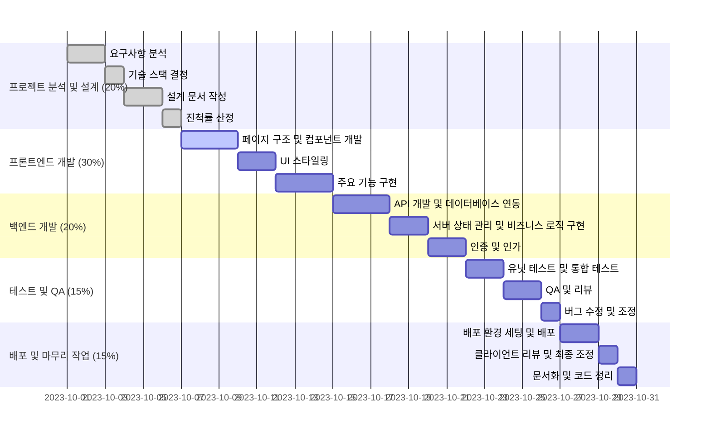

# Odream App

Odream App은 adc에서 진행하는 부트캠프 프로젝트로 KREAM(https://kream.co.kr/) 모바일 웹 클론 앱입니다.
... 는 아직 작업중🚧

## Gantt Chart

## 사용된 기술 스택

- NextJS
- Typescript
- Redux toolkit
- React-query
- Next-auth
- Axios
- Jest
- pnpm
- Tailwind CSS

### 필수 기능 범위

1. 회원가입
2. 로그인/로그아웃
3. 마이페이지
4. Style 게시판

### Key Results

- 분석/설계 [o]
- 기능 구현 [o]
- 코딩 컨벤션 [o]
  - 네이밍 룰, 코드 스타일, 등 프론트엔드, 커밋 컨벤션 등 코드 전반에 관한 컨벤션 문서 작성
  - lint, prettier, husky 도입
- 테스트 자동화 도구 도입/활용 []
- 스토리북 도입 []
- 배포 []

### 프로젝트 구조

- app
  - (main)
    - list
    - detail
    - upload
      - edit
  - search
  - (account)
    - login
    - signup
    - find-email
    - find-pass
  - mypage
    - profile
    - info
  - components
    - ui
  - lib
  - types
  - utils
